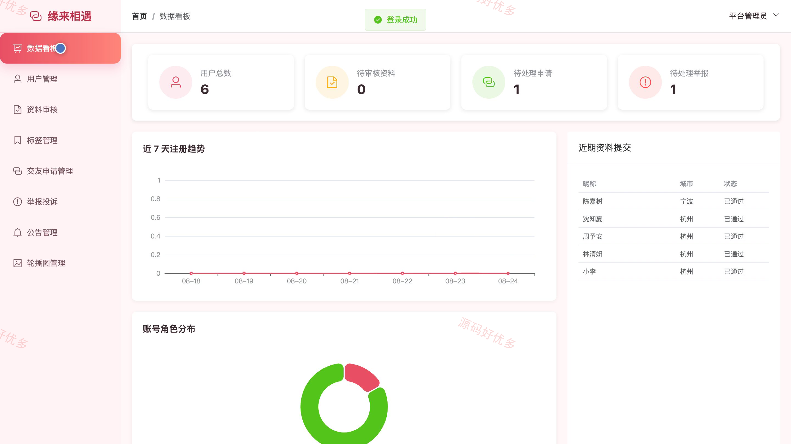
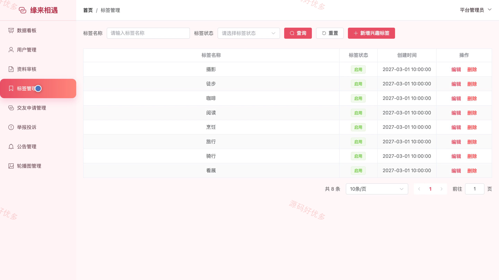
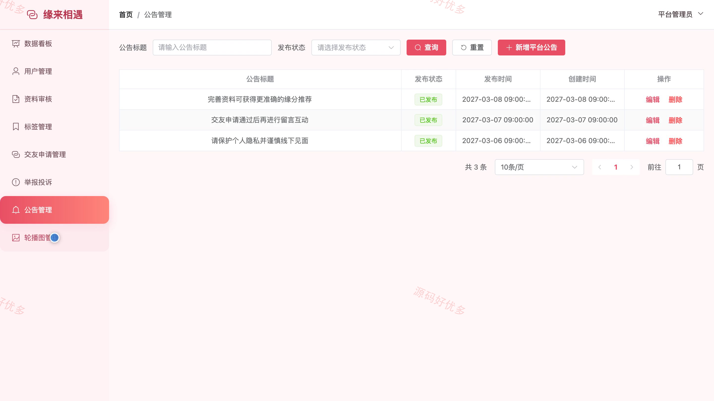

## 源码问题查看主页咨询

### 一、关键词
相亲交友、婚恋服务、在线交友、缘分匹配、交友社区

### 二、作品包含
源码+数据库+万字设计文档+PPT+全套环境和工具资源+本地部署教程

### 三、项目技术
前端技术： Html、Css、Js、Vue3.4、Element-Plus
后端技术：Java、SpringBoot3.2.0、MyBatis-Plus

### 四、运行环境（以下版本亲测，其他版本兼容性请自行测试）
开发工具：IDEA/eclipse + VSCODE

数据库：MySQL5.7+（共11张表）

数据库管理工具：Navicat10以上版本

环境配置软件： JDK17 + Maven

前端Nodejs：16+

浏览器：谷歌浏览器

### 五、项目介绍
项目编号：bs062A

系统面向希望在线认识合适对象的用户与平台管理员，围绕真实资料审核、择偶条件、缘分浏览、智能匹配、收藏申请、留言互动和举报处理形成完整交友流程，并通过公告与安全提示帮助用户保护个人隐私。

角色：用户、管理员

用户功能：注册登录与账户安全、个人资料与择偶条件、缘分浏览与智能匹配、心动收藏、交友申请、留言互动、举报反馈。

管理员功能：用户管理、资料审核、标签管理、交友申请管理、举报投诉、公告管理、轮播图管理、数据统计。

### 六、运行截图

